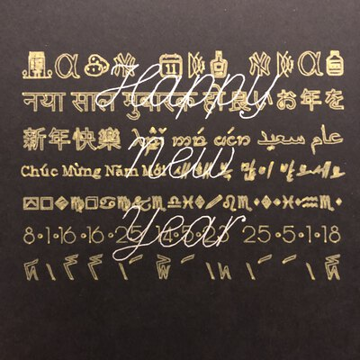
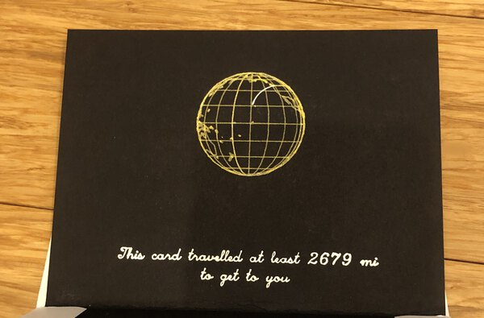

# Greeting Cards 2021



Partially automated generation of personalized greeting cards for friends and family in 2021, made using a 2-D plotter.

## Installation
Like for many projects, it is recommended you use a [https://docs.python.org/3/tutorial/venv.html](virtual environment) to avoid package conflicts. 

```
git clone https://github.com/colinjroberts/greeting-cards-2021.git
cd greeting-cards-2021
pip install 'vpype[all]'
pip install requirements.txt
```

vpype requirements are first installed separately to avoid potential problems. For more information on vpype installation, see [https://vpype.readthedocs.io/en/stable/install.html](vpype's documentation)

## Code and Description

### Directory Structure and Files
This script assumes the file directory below. Scripts should be executed from the root directory of this project.
```
.
├── code
│   ├── card-fronts.py
│   ├── card-insides-per-person.py
│   └── envelopes.py
├── data
│   └── card-recipients.csv
├── envelopes
├── inside
│   ├── 11x17
│   │  ├── combined
│   │  └── individual
│   ├── person-maps
│   └── templates
└── outside
   └── 11x17
      ├── combined
      └── individual
```

- **data**: holds scripts and recipient data
- **inside**: holds all info needed for generating card insides
- **inside>11x17>combined**: holds aggregated 11x17 files, 2 svgs for roughly every 4 cards
- **inside>11x17>individual**: holds individual 11x17 files, 2 svgs for roughly every card
- **inside>person-maps**: holds customized maps for each person
- **inside>templates**: holds template maps
- **outside**: holds all info needed for generating card insides
- **outside>11x17>combined**: holds 2 aggregated 11x17 svgs (one for each layer of the outside)
- **outside>11x17>individual**: holds 8 11x17 svgs (one for each corner of each layer of the outside)

### Inputs

**Recipient Data**

A table of recipient data. This year's spreadsheet contained the following columns (though not all were used in this code). The example csv uses fake data, though the GPS locations are real random locations found in those cities.

- CardInsideName: Salutation name to use inside cards
- MapBaseFile: name of the template map file to use without file extension
- MapFullFileName: name of customized map file for that person
- Message: Message to write inside the card
- Distance: Distance between my location and recipient's location, calculated in-spreadsheet looking at column CalcDistance and rounding if Units column is km, otherwise converting to miles and rounding
- Units: Units distance should be displayed in (km or mi)
- MessageLength: Length of characters in message to help debug messages that were too long
- AddressName: Name to use on envelope
- AddressLine1: Line 1 of address, the unit number and street in many cases
- AddressLine2: Line 2 of address, the city, state, and zip code in many cases
- AddressLine3: Line 3 of address, the country in many cases
- AlternateAddress: A different address or address in different writing system
- Address-OneLine: AddressName and Line fields concatenated into a single line for easy checking
- Latitude: Latitude of address
- Longitude: Longitude of address
- CalcDistance: Distance between my location and the recipient calculated in-spreadsheet using the Haversine formula 

**Map Templates**

These are one map per location, for example one svg for the USA, one svg covering several continents and the atlantic ocean, one svg for my state, etc. Each template map has 3 layers in this order: map, arc from me (sender) to the recipient, and bounding box rectangle (5.5in x 8.5in; 139.7mm x 215.9mm) used later for checking positioning.

Map template files are included in the templates folder (licenses below) as examples of how the code can be used. Users should provide their own maps.
- Washington modified from [https://commons.wikimedia.org/wiki/File:Map_of_Washington_counties,_blank.svg](Wikipedia) - Public Domain
- USA modified from [https://www.amcharts.com/svg-maps/?map=usa](amCharts) - [https://creativecommons.org/licenses/by-nc/4.0/](Creative Commons Attribution-NonCommercial 4.0 International License)
- Atlantic and Pacific generated using [https://www.amcharts.com/docs/v4/](amCharts v4) - [https://creativecommons.org/licenses/by-nc/4.0/](Creative Commons Attribution-NonCommercial 4.0 International License)

**Custom Map Files**

After creating template map svgs, I used the spreadsheet to copy one template for each person named using the MapFullFileName field. Then I manually opened each file and adjusted the arc on layer 2 to show roughly the correct sender and recipient locations.

### Outputs
This code ultimately generates one composite svg (11in x 17in; 279.4mm x 431.8mm) with four svgs arranged on it for each layer to be printed. In this case, that is 2 files for the outside of the card (total because everyone had the same outside) and 2 files roughly every 4 card insides (each person had a different card inside, and 4 cards fit on a page). It also generates a number of intermediate files (2 files for each card inside) that are not deleted for easier debugging and quality control.

### Overall Process
If you are looking to replicate a process like this, these are the general steps I took:

- Create spreadsheet of recipients
- Create card outsides
- Generate aggregated card outside svgs (1 file for each of 2 layers, same shapes repeated 4 times - once in each corner)
- Find/create/clean up base map files
- Generate custom maps for each person
- Generate aggregated card inside files for everyone (1 file for each of 2 layers, different card in each corner)
- Print card outsides, flip paper, print card insides
- Cut cards, stuff envelopes, and mail!

## Ideas and Description 
Last year, The Partner (TP) and I tried to lift our quarantined spirits with an [AxiDraw](https://www.axidraw.com/) that we used to make a bunch of holiday cards for friends and family. This year, I wanted to build on those and make something that...
- had some kind of puzzle or provided a "figuring out" experience
- made use of the fact that a plotter can use more interesting and specialized inks than a typical printer
- was more automated than last year
- was, of course, personalized to each recipient

I toyed around with a number of ideas and landed on everyone getting the same card front which allowed me to include some interesting linguistic and numeric curiosities I found this past year, and a personalized inside that would draw a line from our house to the recipient. 

### Supplies
- 100lb 11x17 Black paper from ThunderBolt Paper on Amazon (the nicer paper I ordered hadn't arrived in time)
- Many gold and silver 1mm Signo pens

### Card Outside
The outside has a dense front of the card and a blank back. The front has two layers. One layer is the phrase "Happy New Year" written in one color. The other layer is a series of messages in a different color. The messages were a combination of vector images and paths created from fonts and modified for better plotting. Understanding the content of the messages is left as an exercise for the reader. 


### Card Inside
For the insides, the top half would be a map with a line drawn from our location to the recipient and some text saying how far the card had travelled. Starting with a spreadsheet of recipients, I manually looked up GPS coordinates and performed a rudimentary point to point arc-distance calculation in kilometers (but converted to miles for US-based recipients). Each person was assigned one of several maps. Some of the maps (Seattle and Washington) were found online and drastically simplified. The rest were globe maps created with [amcharts4](https://github.com/amcharts/amcharts4). 

There were three main layout complexities:
1. Each map needed a different line connecting my location to the destination
2. Seattle maps were vertical and needed different text placement than the globe maps
3. Some cards needed distance in miles and others kilometers


**Each map needed a different line connecting my location to the destination**

To give everyone the right map, the spreadsheet for keeping track of names, addresses and distances included a column for which map the person should get. After making/modifying each of the map files and assigning each person a map, I made a copy of the correct map for each person. Then I manually added an arc (often needing to look up where people lived). While this step could possibly be automated especially if all of the maps were the same (for example if they were all generated with amcharts), it felt like finding and setting up a tool to do that for me would have taken longer than the hour or two I spent moving lines for each of the maps.

**Seattle maps were vertical and needed different text placement than the globe maps**

Most of the maps (which were generated with [amcharts4](https://github.com/amcharts/amcharts4)) were horizontally centered and the distance text was placed underneath it. Seattle's map was much taller than the others, so instead of having a centered image with text underneath it, I put the Seattle map on the left half of the card and generated left-aligned text to be place beside it. This required a second code path to generate slightly different lines of text at different positions.

**Some cards needed distance in miles and others kilometers**

In an attempt to reduce code paths (having already duplicated code for handling the Seattle map), I decided to have my spreadsheet generate the text for the distance. After calculating the distance from me to the recipient in km, a distance column noted whether the distance should stay in "km" or be converted to "mi". The code for generating text concatenates the numeric distance column and the units column. Some examples (not including Seattle for privacy reasons).





### Envelope
Last year, I had the [AxiDraw](https://www.axidraw.com/) hooked up to an old laptop that could run InkScape and used [AxiDraw's excellent Hershey merge tool](https://wiki.evilmadscientist.com/AxiDraw_Merge). This year, the AxiDraw is connected to a RaspberryPi running [Saxi](https://github.com/nornagon/saxi) which is a little more streamlined and convenient than AxiDraw tools for InkScape. As for the card insides, I used [vpype](https://github.com/abey79/vpype) to generate and layout the text for the envelopes, saving each one as a separate svg that I'd manually drop into Saxi to plot.

### Printing
Last year, I printed each card individually. I learned that one aspect of plotting I like to avoid is the setup and restarting of the plotter. This year, I bought large format paper so I could print multiple cards at a time and reduce the number of times I need to set up new plots. 

First I printed all of the letters that would be inserted into the cards (two letters to a page that I later cut to size). Once those were complete, I started printing all of the card fronts (including a good number of which were printed upside down) four to a page that I later cut. Finally, after I completed the maps and messages for the personalized insides, I printed those onto the cards. 

Finally, I printed all of the cards. Because I used [Saxi](https://github.com/nornagon/saxi) as the plotter driver this year, I couldn't make use of the [AxiDraw](https://github.com/evil-mad/axidraw)'s excellent Hershey merge tool. Instead, as described above, I used vpype to generate each file and plotted them separately.

### Lessons Learned for Next Year

**Do tedious plotting first**

While I did optimize card printing to reduce the number of times I needed to start a print, I still needed to print each envelope separately. I found myself avoiding this task as it took place toward the end of the project after all the fun stuff was done. Next year, I will likely try to address all of the envelopes early on in the process while my project energy is still high.

**Automate more of the process**

This project is always going to take a lot of time and effort, and I kind of like it that way. That said, automating where possible is a good idea. It would be great if next year's idea didn't require any manual handling for each card and could just be generated given a list of folks.

**Batch manual work together**

I would prefer to bunch all of my manual handling steps into one such that after cutting all of the cards out, I could have one night of printing envelopes with TP, signing, stuffing, and stamping.
